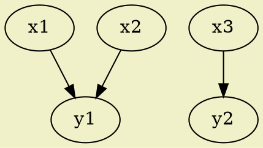
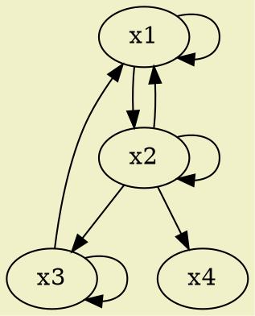
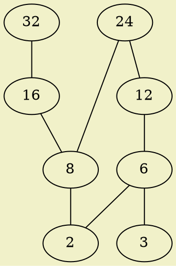

@import "./local.less"
***
## 第五章 关系

***
### #1 关系的概念

#### 1.序偶的概念
**序偶(有序对、二元组)** ： 由两个固定次序个体所组成的序列，记作$<x, y>$。
**序偶的顺序** ： 序偶$<a, b>$中，$a$被称为第一元素，$b$被称为第二元素，仅有$a=x \wedge b=y$时，才有$<a, b>=<x, y>$。
**序偶的推广 - 多重序元** ： 序偶可以推广至多重序元($N$元组)，三重序元是一个序偶，其第一元素为一序偶，例如$<<a, b>, c>$。三重序元可以简写为$<a, b, c>$的形式。而对于$N$重序元($N \ge 3$)而言，其第一元素为${N-1}$重序元，可简写为$<x_1, x_2, x_3,  ... ,  x_N>$之形式。其中第$i$元素$x_i$通常被称为$N$元组之第$i$坐标。

#### 2.笛卡尔乘积及其性质
**笛卡尔乘积** ： 给定两个集合$A$与$B$，由所有第一元素属于$A$，第二元素属于$B$的序偶所构成的集合，称为集合$A$与集合$B$的笛卡尔乘积，记作$A \times B$，表示为$A \times B = \{<x, y>|(x \in A)\wedge (y \in B)\}$。显然，两个集合的笛卡尔乘积是一个由序偶构成的集合。为了表示方便，可以记$A \times A$为$A^{2}$，$A \times A \times A$为$A^{3}$，$\underbrace{A \times A \times \cdots \times A }_{N}$为$A^N$。
**定理1** ： 
1. $A \times ( B\cup C) = (A \times B) \cup (A \times C)$
1. $A \times ( B\cap C) = (A \times B) \cap (A \times C)$
1. $(A \cup B) \times C = (A \times C) \cup (B \times C)$
1. $(A \cap B) \times C = (A \times C) \cap (B \times C)$

**定理2** ：
设$A$，$B$与$C$为任意三个集合，且$C \not= \varnothing$，则有$(A \times C)\subseteq (B \times C)$和$(C \times A) \subseteq (C \times B)$都是$A \subseteq B$的充要条件。

**定理3** ：
设$A$，$B$，$C$，$D$为四个非空集合，则$(A \times B) \subseteq (C \times D)$的充要条件为$(A \subseteq C) \wedge (B \subseteq D)$。

#### 3.关系相关的概念
**关系** ： 设$A$、$B$为两个集合，则$A \times B$的任何一子集都称为$A$到$B$的二元关系。
**N元关系** ： 设$A_1$，$A_2$，...，$A_N$是$N$个集合，则$A_1 \times A_2 \times ... \times A_N$的任一子集都称为他们之间的一个N元关系。
**常见的关系表示方法** ： 一般用大写字母表示二元关系，在数学中也常用一些特殊符号表示关系，如大于、小于等。此外，还有一种$aRb$的表示方法，等价于$<a, b> \in R$，如果要表示$<a, b> \notin R$，则记为$a {R\mkern-10.5mu/} b$。而对于从$A$到$A$的二元关系，可以称之为$A$中的二元关系。

**定义域** ： 若存在$y \in Y$，使有$<x, y> \in S$，则所有这样的$x \in X$，被称为二元关系$S$的定义域，记为$D(S)$或$\rm{dom} (S)$，表示为$D(S) = \{x|(\exist y)((x \in X) \wedge (y \in Y) \wedge (<x, y> \in S))\}$。
**值域** ： 若存在$x \in X$，使有$<x, y> \in S$，则所有这样的$y \in Y$，被称为二元关系$S$的值域，记为$R(S)$或$\rm{ran}(S)$，表示为$R(S) = \{y|(\exist x)((x \in X) \wedge (y \in Y) \wedge (<x, y> \in S))\}$。
**显而易见，$D(S) \subseteq X$，$R(S) \subseteq Y$。**

设定$X$为一集合。
**空关系** ：$\varnothing$被称为$X$中的空关系。
**全域关系** ： $X^{2}$被称为$X$中的全域关系。
**恒等关系** ： $I_X = \{<x, x>|x \in X\}$被称为$X$中的恒等关系。

***
### #2 二元关系的表示方法及其基本性质
#### 1.矩阵表示法
若给定两个有限集合$X = \{x_1,x_2,...,x_m\}$与$Y = \{y_1,y_2,...,y_n\}$，且，$R$为$X$到$Y$的二元关系，若有
$$
r_{ij} = 
\left\{ 
    \begin{array}{ll}
        1 & \textrm{若}x_iRy_j\\
        0 & \textrm{若}x_i {R\mkern-10.5mu/} y_j
    \end{array} \right.
$$
则称矩阵$[r_{ij}]$为$R$的关系矩阵，记作$\bold{M}_R$。
$$
\bold{M}_R=
 \left[
 \begin{matrix}
   1 & 0 & 0 \\
   0 & 1 & 1 \\
   0 & 1 & 0
  \end{matrix}
  \right]
$$

#### 2.图像表示法
设$X = \{x_1,x_2,...,x_m\}$与$Y = \{y_1,y_2,...,y_n\}$，且，$R$为$X$到$Y$的二元关系。在图上画$m$个圈（顶点），表示$x_i$，画$n$个圈，表示$y_j$，如果$x_i R y_j$，便在代表$x_i$与$y_j$的两顶点之间画一条有向的弧（边）。通过这种方法作出的图被称为$R$的关系图。如果是$X$内的二元关系，则可以只画一次$X$的元素。

#### 3.二元关系的五个基本性质
设$R$是集合$X$中的二元关系。
**自反关系** ： $(\forall x)(x \in X \Rightarrow <x, x> \in R)$
**反自反关系** ： $(\forall x)(x \in X \Rightarrow <x, x> \notin R)$
**对称关系** ： $(\forall x)(\forall y)((x \in X \wedge y \in Y \wedge <x, y> \in R) \Rightarrow <y, x> \in R)$
**反对称关系** ： $(\forall x)(\forall y)((x \in X \wedge y \in Y \wedge <x, y> \in R) \Rightarrow <y, x> \notin R)$
**传递关系** ： $(\forall x)(\forall y)(\forall z)((x \in X \wedge y \in Y \wedge z \in Z \wedge <x, y> \in R \wedge <y, z> \in R) \Rightarrow <x, z> \in R))$

***
### #3 等价关系与划分
#### 1.等价关系
**等价关系** ： 设$R$是集合$X$中的二元关系，若$R$是自反的、对称的、传递的，则$R$是等价关系。
**等价类** ： 设$R$是非空集合$X$中的等价关系，对于任一确定的$x \in X$，均可以作一$X$的子集$[x]_R$，称为由$x$生成（以$x$为代表元素的）$R$的等价类，表示为$[x]_R = \{y|(y \in X) \wedge (<x, y> \in R)\}$。则所有与$x$有等价关系$R$的所有元素构成的集合便是$[x]_R$。
**定理1** ： 设$R$是集合$X$中的等价关系，对任一$x$，有$x \in [x]_R$。
**定理2** ： 设$R$是集合$X$中的等价关系，有
1. 对任意的$x,y \in X$，要么是$[x]_R = [y]_R$，要么是$[x]_R \cap [y]_R = \varnothing$。
1. $\bigcup_{x \in X}[x]_R=X$

**商集** ： 设$R$是集合$X$中的等价关系。由$X$中的各元素生成的$R$的等价类所有成的集合$\{[x]_R|x \in X\}$称为$X$关于$R$的商集，记作$X/R$。$X/R \subseteq \rho(X)$。

#### 2.覆盖与划分
**覆盖** ： 设$X$为非空集合（可以为无穷集合）。$A={A_1, A_2, ..., A_n}$，其中集合$A_i \subseteq X(i=1,2,...,n)$，且$\bigcup_{i=1}^{n}A_i=X$，则称$A$为$X$的覆盖。
**划分** ： 设$A$是$X$的覆盖，其对任意$i$，$j$，满足$A_i \cap A_j = \varnothing（i \not= j）$，则称$A$为$X$的划分。
**加细** ： 设$A$，$B$为$X$的两个划分，$A = \{A_1, A_2, ..., A_m\}$，$B = \{B_1, B_2, ..., B_n\}$，若对于划分$B$的每一个类$B_i$都存在$A$的一个类$A_j$，使得$B_j \subseteq A_i$，则称$B$为$A$的加细，也说$B$加细了划分$A$。
**真加细** ： 若$B$是$A$的加细，且$B \not= A$，则称$B$是$A$的真加细。

**定理1** ：设$R$是非空集合$X$中的关系，则$X$对$R$的商集$X/R$是$X$的一种划分。
**定理2** ：设$A$是非空集合$X$的一种划分。$A = \{A_1, A_2, ..., A_n\}$中的关系$R$定义为$\{<x, y>|(\exist A_i)(A_i \in A \wedge x \in A_i \wedge y \in A_i)\}$，则$R$是$X$中的等价关系。
**定理3** ： 设$R_1$和$R_2$是非空集合$X$中的等价关系，则$R_1 = R_2$的充要条件为$X/R_1 = X/R_2$。

***
### #4 相容关系与完全覆盖

#### 1.相容关系
**相容关系** ： 设$R$是集合$X$中的二元关系，如果$R$是自反的、对称的，则称$R$是相容关系。因为所有的相容关系都是自反且对称的，所以在用关系矩阵表示之时，可以仅记下矩阵做对角线以下的内容；而在用关系图表示时，可以省去各个闭路，用两点间的连线代替往返有向弧。
**最大相容类** ： 设$R$是集合$X$中的相容关系。若有$X_1 \subseteq X$，使得对于任意$x, y \in X_1$，有$<x, y> \in R$，而在$X - X_1$中没有任何一个元素与$X_1$中的所有元素都存在$R$关系，则称$X_1$为由$R$产生的最大相容类。

#### 2.完全覆盖
**完全覆盖** ： 由$R$产生的所有最大相容类所构成的集合称为集合$X$的完全覆盖，记作$C_R(X)$。
**关系图法求完全覆盖** ： 先画出相容关系的简化关系图，然后找出所有的“最大完全多边形”（所有顶点之间均有连线），这些多边形的顶点构成的集合的集合就是所要求的完全覆盖。

**定理1** ： 设$R$是集合$X$中的相容关系。对任一$x \in X$，必存在一$X_i \in C_R(X)$使得$x \in X_i$。
**定理2** ： 设$R$是非空有限集合$X$中的相容关系，则存在$X$的完全覆盖$C_R(X)$，且$C_R(X)$是$X$的覆盖。
**定理3** ： 给定集合$X$的一个覆盖$A = \{A_1, A_2, ..., A_n\}$，由它确定的关系$R = A_1 \times A_1 \cup A_2 \times A_2 \cup ... \cup A_n \times A_n$是相容关系。

***
### #5 关系的运算
显然，关系可以直接继承集合的所有操作。

#### 1.关系的合成运算
**关系的合成运算** ： 设$R$是集合$X$到集合$Y$的关系，$S$是集合$Y$到集合$Z$的关系，则$R \circ S$称为$R$和$S$的合成关系，定义为：$R \circ S=\{<x, z>|(x \in X) \wedge (z \in Z) \wedge (\exist y)(y \in Y \wedge <x, y> \in R \wedge <y, z> \in S)\}$
需要注意的是，这种运算合法的前提是$R(R) \subseteq Y \wedge D(S) \subseteq Y$，当$R(R) \cap D(S) = \varnothing$时，有$R \circ S = \varnothing$。
**关系的n次幂** ： 设$R$是集合$X$中的二元关系，$n \in \bold{N}$，定义$R$的$n$次幂为
$R^0 = I_X$，$R^{n+1} = R^n \circ R$
**合成运算的矩阵表示法** ： 设有$\bold{M}_R$为$m \times n$的矩阵，$\bold{M}_S$为$n \times p$的矩阵，分别表示为
$$
\bold{M}_R=
\left[
\begin{matrix}
 a_{11}      & a_{12}      & \cdots & a_{1n}      \\
 a_{21}      & a_{22}      & \cdots & a_{2n}      \\
 \vdots & \vdots & \ddots & \vdots \\
 a_{m1}      & a_{m2}      & \cdots & a_{mn}      \\
\end{matrix}
\right]
$$
$$
\bold{M}_S=
\left[
\begin{matrix}
 b_{11}      & b_{12}      & \cdots & b_{1p}      \\
 b_{21}      & b_{22}      & \cdots & b_{2p}      \\
 \vdots & \vdots & \ddots & \vdots \\
 b_{n1}      & b_{n2}      & \cdots & b_{np}      \\
\end{matrix}
\right]
$$
则由这两个关系矩阵构造出的合成运算的结果为$\bold{M}_R \circ \bold{M}_S$:
$$
\bold{M}_R \circ \bold{M}_S=
\left[
\begin{matrix}
 c_{11}      & c_{12}      & \cdots & c_{1p}      \\
 c_{21}      & c_{22}      & \cdots & c_{2p}      \\
 \vdots & \vdots & \ddots & \vdots \\
 c_{m1}      & c_{m2}      & \cdots & c_{mp}      \\
\end{matrix}
\right]
$$
$$
C_{ij} = \bigvee_{k=1}^{n}(a_{ik} \wedge b_{kj})
$$

**定理1** ： 设$R$是集合$X$到集合$Y$的二元关系，$S$是从集合$Y$到集合$Z$的二元关系，则有$\bold{M}_R \circ \bold{M}_S = \bold{M}_{R \circ S}$。

设$R_1$是集合$X$到集合$Y$的二元关系，$R_2$和$R_3$是集合$Y$到集合$Z$的二元关系，$R_4$是$Z$到$W$的二元关系，
**定理2** ： 若有$R_2 \subseteq R_3$成立，则有$R_1 \circ R_2 \subseteq R_1 \circ R_3$与$R_2 \circ R_4 \subseteq R_3 \circ R_4$成立。
**定理3** ：  
1. $R_1 \circ (R_2 \cup R_3) = (R_1 \circ R_2) \cup (R_1 \circ R_3)$
1. $R_1 \circ (R_2 \cap R_3) \subseteq (R_1 \circ R_2) \cap (R_1 \circ R_3)$
1. $(R_2 \cup R_3) \circ R_4 = (R_2 \circ R_4) \cup (R_3 \circ R_4)$
1. $(R_2 \cap R_3) \circ R_4 \subseteq (R_2 \circ R_4) \cap (R_3 \circ R_4)$

**定理4** ： $(R_1 \circ R_2) \circ R_3 = R_1 \circ (R_2 \circ R_3)$
**定理5** ： 设$R$是集合$X$内的二元关系，$m,n \in \bold{N}$，有$R^m \circ R^n = R^{m+n}$与$(R^m)^n = R^{m \cdot n}$成立。
**定理6** ： 设$R$是有限集$X$内的二元关系，$|X|=n$，则存在$s,t$，使$R^t = R^s, 0 \le s <t \le 2^{n^2}$成立。

#### 2.关系的逆运算
**逆运算的定义** ： 设$R$是集合$X$到集合$Y$的二元关系，则从$Y$到$X$的关系$R$之逆运算定义为$R^{-1} = \{<y, x>|<x, y> \in R\}$

**定理1** ： 设$R$与$S$皆为从集合$X$到集合$Y$的二元关系，有
1. $(R^{-1})^{-1} = R$
1. $(R \cup S)^{-1} = R^{-1} \cup S^{-1}$
1. $(R \cap S)^{-1} = R^{-1} \cap S^{-1}$
1. $(\sim R)^{-1} = \sim (R^{-1})$ 全集为$X \times Y$
1. $(R - S)^{-1} = R^{-1} - S^{-1}$

**定理2** ： 设$R$是集合$X$中的二元关系，$R = R^{-1}$为$R$具备对称性的充要条件。
**定理3** ： 设$R$是集合$X$到集合$Y$的二元关系，$S$是集合$Y$到集合$Z$的二元关系，则有$(R \circ S)^{-1} = S^{-1} \circ R^{-1}$

#### 3.关系的闭包运算
所谓闭包运算，就是通过尽可能少地向一关系中添加序偶，使之获得自反、对称或传递性。
正式定义如下
**自反闭包** ： 设$R$是集合$X$中的二元关系，如果有$X$中的关系$R'$满足
$(1)R'$具备自反性且$R' \supseteq R$，$(2)$对$X$中的任意自反关系$R''$，如果有$R'' \supseteq R$，则有$R'' \supseteq R'$成立
那么称$R'$为$R$的自反闭包，记作$r(R)$。
**对称闭包** ： 设$R$是集合$X$中的二元关系，如果有$X$中的关系$R'$满足
$(1)R'$具备对称性且$R' \supseteq R$，$(2)$对$X$中的任意对称关系$R''$，如果有$R'' \supseteq R$，则有$R'' \supseteq R'$成立
那么称$R'$为$R$的对称闭包，记作$s(R)$。
**传递闭包** ： 设$R$是集合$X$中的二元关系，如果有$X$中的关系$R'$满足
$(1)R'$具备传递性且$R' \supseteq R$，$(2)$对$X$中的任意传递关系$R''$，如果有$R'' \supseteq R$，则有$R'' \supseteq R'$成立
那么称$R'$为$R$的传递闭包，记作$t(R)$。

**定理1** ： 设$R$是集合$X$中的二元关系，有
1. $R$有自反性$\Leftrightarrow r(R) = R$
1. $R$有对称性$\Leftrightarrow s(R) = R$
1. $R$有传递性$\Leftrightarrow t(R) = R$

**定理2** ： 设$R$是集合$X$中的二元关系，有
1. $R$有自反性$\Rightarrow s(R),t(R)$有自反性
1. $R$有对称性$\Rightarrow r(R),t(R)$有对称性
1. $R$有传递性$\Rightarrow r(R)$有传递性

**定理3** ： 设$R$是集合$X$中的二元关系，有
1. $rs(R) = sr(R)$
1. $rt(R) = tr(R)$
1. $ts(R) \supseteq st(R)$

**定理4** ： 设$R$是集合$X$中的二元关系，有
1. $r(R) = R \cup I_X$
1. $s(R) = R \cup R^{-1}$
1. $t(R) = R \cup R^2 \cup \cdots \cup R^{\infty}$

**定理5** ： 设$R$是集合$X$中的二元关系，有$R^{n+1} \subseteq \bigcup_{i=1}^{\infty}R^i \Leftrightarrow t(R) = \bigcup_{i=1}^{n}R^i$
**定理6** ： 设$R$是集合$X$中的二元关系，$R^2 \subseteq R \Leftrightarrow R$具备传递性
**定理7** ： 设$R$是集合$X$中的二元关系，则存在$k \le |X|$，使$t(R) = \bigcup_{i=1}^{k}R^i$

**求解传递闭包算法 - Floyd-Warshall算法** ：
1. 新建矩阵$A = \bold{M}_R$
1. 新建索引变量$i=1$
1. 遍历$A$的第$i$列元素，对于所有$A[j, i] = 1$，遍历$A$的第$j$行，$A[j, k] = A[j, k] \wedge A[i, k]$
1. 索引$i++$，若$i \le n$，回到上一步

***
### #6 偏序关系

#### 1.偏序关系
**偏序关系** ： 设$R$是集合$X$中的二元关系，如果$R$具备自反性、传递性、非对称性，则其为偏序关系。一般使用符号$\le$表示偏序关系$R$。

**盖住** ： 在偏序集合$<P, \le>$中，如果有$x, y \in P$，$x \le y \wedge x \not= y$，并且不存在任何其他元素$z \in P$，使得$x \le z \wedge z \le y$，则称元素$y$盖住了$x$。
**哈塞图** ： 一种简明的表示偏序关系的关系图，接下来使用*盖住*性质来构造一张哈塞图：
使用小圆圈表示集合$P$中的元素，如果$x \le y \wedge x \not= y$，则将代表$y$的圈画在代表$x$的之上。若$y$盖住了$x$，则用直线连结它们。
下面是一张示意图，表示$X = \{2,3,6,12,24,36\}$上的$\le = \{<x, y>|(x, y \in X) \wedge (y/x \in \bold{I}_{+})\}$

#### 2.全序关系
**全序关系** ： 设$\le$是集合$X$中的偏序关系，若对任意的$x, y \in X$，必有$x \le y$或$y \le x$成立，即$x$与$y$之间可以比较，则称$\le$为$X$中的全序关系。也称之为简单序、线性序。而序偶$<X, \le>$则被叫做全序集、线性序集。
**链** ： 设$<X, \le>$是一个偏序集，$Y$是$X$的一个子集，若$\le$在$Y$中是全序关系，则称$Y$是一条链，其模被称为链的长度。显然，所有全序集都是链。
**反链** ： 设$<X, \le>$是一个偏序集，$Y$是$X$的一个子集，$Y$中的任何两个不同元素之间都不存在关系，则称$Y$是一条反链。
显然，由$X$中的任意单个元素构成的集合，既是链，也是反链。

**定理1** ： 设$<X, \le>$为一偏序集，若$X$中的最长链之长度为$n$，则$X$中的元素可以被划分为$n$条不相交的反链。
**定理2** ： 设$<X, \le>$为一模为$mn+1$的偏序集，则其中要么有一条$m+1$长度的反链，要么存在一条$n+1$长度的链。

**最小元、最大元** ： 设$<X, \le>$为一偏序集，$Y \subseteq X$。若存在元素$a \in Y$，使得对于任一$y \in Y$，都有$a \le y$（或都有$a \ge y$），则称$a$为集合$Y$的最小元、最小成员（或最大元、最大成员）。值得注意的是不一定每个集合都有其最小元（最大元）。

**定理** : 若集合存在最小元（最大元），则其必唯一。

**极小元、极大元** ： 设$<X, \le>$为一偏序集，$Y \subseteq X$，且不存在$y \in Y, y \not= a$，使得$a \ge y$（或$a \le y$），则称$a$为集合$Y$中的极小元（或极大元）。值得注意的是，极小元（或极大元）是可以不唯一的。

**上界、下界** ： 设$<X, \le>$为一偏序集，$Y \subseteq X$，若$a \in X$，使得对于任意$y \in Y$都有$y \le a$（或$y \ge a$），则称$a$为集合$Y$的上界（下界）。
**最小上界、最大下界** ： 设$<X, \le>$为一偏序集，$Y \subseteq X$，若$a$是$Y$的上界（或下界），且对于$Y$之任意上界（或下界）$y$，均有$a \le y$（或$a \ge y$）成立，则称$a$为集合$Q$之最小上界（或最大下界），记作$\text{LUBQ}$(或$\text{GLBQ}$)。
显然，上界（下界）不一定唯一；最小上界（最大下界）若存在，则必然唯一。

#### 3.良序关系和拟序关系
**良序集、良序关系** ： 设$<X, \le>$为一偏序集，若$X$的任一非空子集都有最小元，则称$<X, \le>$为良序集，称$\le$为良序关系。
**定理** ： 任何有限全序集必然是良序集，而任何良序集一定是全序集。

偏序关系对应着数学中的$\le$，而对于数学中的$<$，则有拟序关系与之对应。
**拟序关系** ： 设$R$是集合$X$中的二元关系，若其为反自反的、传递的，则其为拟序关系。

**定理** ：设$R$是集合$X$中的二元关系，有
1. $R$是拟序关系，则$r(R)$是个偏序关系。
1. 若$R$是个偏序关系，则$R-\bold{I}_X$是个拟序关系。

很显然，偏序关系和逆序关系之区别就在于恒等关系$\bold{I}_X$。